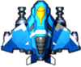
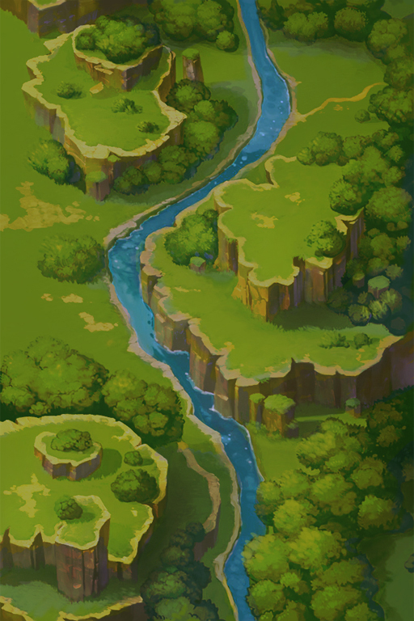

<div align="center">

# ✈️ Aircraft War · 飞机大战

> **基于 Java Swing 的经典飞机射击游戏 —— 设计模式实战项目**

[](https://www.java.com/)
[](https://docs.oracle.com/javase/tutorial/uiswing/)
[](https://junit.org/junit5/)
[]()



</div>

---

## 📋 目录

- [🎮 游戏简介](#-游戏简介)
- [✨ 核心特色](#-核心特色)
- [🏗️ 系统架构](#️-系统架构)
- [🧩 设计模式](#-设计模式)
  - [工厂方法模式](#工厂方法模式)
  - [简单工厂模式](#简单工厂模式)
  - [策略模式](#策略模式)
  - [观察者模式](#观察者模式)
  - [单例模式](#单例模式)
  - [模板方法模式](#模板方法模式)
- [👾 敌机体系](#-敌机体系)
- [💎 道具系统](#-道具系统)
- [🎯 难度系统](#-难度系统)
- [🎵 音频系统](#-音频系统)
- [💾 数据持久化](#-数据持久化)
- [📦 项目结构](#-项目结构)
- [🚀 快速开始](#-快速开始)
- [🖥️ 操作说明](#️-操作说明)
- [📷 界面预览](#-界面预览)
- [🛠️ 技术栈](#️-技术栈)
- [📜 许可证](#-许可证)

---

## 🎮 游戏简介

**Aircraft War**（飞机大战）是一款基于 Java Swing 开发的 2D 平面射击游戏。玩家使用鼠标操控英雄飞机，在浩瀚天空中与各类敌机展开激战。随着游戏进程推进，敌机生成速度逐渐加快，难度动态提升，Boss 敌机将在关键时刻登场！

本项目是一个**面向对象设计与设计模式**的综合实践项目，综合运用了 **6 种设计模式**，实现了清晰、可扩展的软件架构。

---

## ✨ 核心特色

| 特性 | 说明 |
|------|------|
| 🎯 **三大难度** | 简单 / 普通 / 困难，不同难度拥有不同的背景、敌机参数和 Boss 机制 |
| 👾 **五种敌机** | 从普通杂兵到终极 Boss，各有不同的射击方式和行为 AI |
| 💎 **五种道具** | 回血、炸弹（全屏秒杀）、散射、环射、冰冻，策略丰富 |
| 🔊 **完整音效** | 背景音乐（Boss 切换）、射击、爆炸、道具拾取、游戏结束，多线程播放 |
| 🏆 **排行榜系统** | 记录玩家得分，支持增删查改，文件持久化存储 |
| 🖱️ **鼠标操控** | 拖拽鼠标控制战机位置，操作流畅直观 |
| 📈 **动态难度** | 随时间自动调整敌机速度、生成周期，保持挑战性 |

---

## 🏗️ 系统架构

```
┌─────────────────────────────────────────────────────────┐
│                     Main (入口)                          │
│                    JFrame 主窗口                         │
├─────────────────────────────────────────────────────────┤
│                      Game (抽象基类)                      │
│    ┌───────────────────┬───────────────────────┐        │
│    │   SimpleGame      │    CommonGame         │        │
│    │   (简单模式)       │    (普通模式)          │        │
│    └───────────────────┴───────────────────────┘        │
│                      DifficultGame                       │
│                      (困难模式)                           │
├─────────────────────────────────────────────────────────┤
│  HeroAircraft    EnemyAircraft       BaseProp           │
│  (英雄机·单例)     (敌机体系·工厂)      (道具体系)        │
├─────────────────────────────────────────────────────────┤
│    ShootStrategy    MusicControl     DAO / Record        │
│    (射击策略)        (音效管理·单例)    (数据持久化)        │
└─────────────────────────────────────────────────────────┘
```

### 核心包说明

| 包路径 | 职责 |
|--------|------|
| [`src/edu/hitsz/application/`](src/edu/hitsz/application/) | 游戏主逻辑：Game 框架、难度子类、图片管理、控制器、工厂接口 |
| [`src/edu/hitsz/aircraft/`](src/edu/hitsz/aircraft/) | 飞机实体：英雄机、5 种敌机、火力计时器 |
| [`src/edu/hitsz/basic/`](src/edu/hitsz/basic/) | 基类：可飞行对象的通用行为（移动、碰撞、冰冻） |
| [`src/edu/hitsz/shoot/`](src/edu/hitsz/shoot/) | 射击策略：直线射击、散射、环射 |
| [`src/edu/hitsz/prop/`](src/edu/hitsz/prop/) | 道具系统：5 种道具 + 观察者模式支持 |
| [`src/edu/hitsz/enemyfactory/`](src/edu/hitsz/enemyfactory/) | 敌机工厂：5 种敌机的 Factory 实现 |
| [`src/edu/hitsz/bullet/`](src/edu/hitsz/bullet/) | 子弹实体：英雄子弹、敌机子弹 |
| [`src/edu/hitsz/music/`](src/edu/hitsz/music/) | 音频系统：背景音乐 + 音效播放 |
| [`src/edu/hitsz/DAO/`](src/edu/hitsz/DAO/) | 数据访问层：记录模型、DAO 接口与实现 |
| [`src/edu/hitsz/Swing/`](src/edu/hitsz/Swing/) | UI 组件：难度选择、排行榜面板 |
| [`src/images/`](src/images/) | 游戏图片资源（飞机、子弹、道具、背景） |
| [`src/videos/`](src/videos/) | 音频资源（BGM + 音效） |

---

## 🧩 设计模式

本项目是设计模式的综合实践，共运用了 **6 种设计模式**：

### 工厂方法模式

> [`EnemyManager`](src/edu/hitsz/application/EnemyManager.java) · [`ModEnemyFactory`](src/edu/hitsz/enemyfactory/ModEnemyFactory.java) · [`EliteEnemyFactory`](src/edu/hitsz/enemyfactory/EliteEnemyFactory.java) · [`ElitePlusEnemyFactory`](src/edu/hitsz/enemyfactory/ElitePlusEnemyFactory.java) · [`EliteProEnemyFactory`](src/edu/hitsz/enemyfactory/EliteProEnemyFactory.java) · [`BossEnemyFactory`](src/edu/hitsz/enemyfactory/BossEnemyFactory.java)

每种敌机都有自己的工厂类，统一实现 [`EnemyManager`](src/edu/hitsz/application/EnemyManager.java) 接口。`Game` 类根据概率随机选择工厂，解耦了"敌机创建"与"敌机使用"。

```java
// EnemyManager 接口
public interface EnemyManager {
    EnemyAircraft createEnemy(int speedY, int hp);
}
```

### 简单工厂模式

> [`PropManager`](src/edu/hitsz/application/PropManager.java)

道具的创建使用简单工厂，根据字符串类型名生成对应的道具实例，避免在敌机代码中直接 `new` 具体道具类。

```java
public static BaseProp createProp(String type, int x, int y, int sx, int sy) {
    switch (type) {
        case "BloodProp":      return new BloodProp(x, y, sx, sy, 30);
        case "BombProp":       return new BombProp(x, y, sx, sy);
        case "BulletProp":     return new BulletProp(x, y, sx, sy);
        case "BulletPlusProp": return new BulletPlusProp(x, y, sx, sy);
        case "FreezeProp":     return new FreezeProp(x, y, sx, sy);
    }
}
```

### 策略模式

> [`ShootStrategy`](src/edu/hitsz/shoot/ShootStrategy.java) · [`StraightShoot`](src/edu/hitsz/shoot/StraightShoot.java) · [`ScatterShoot`](src/edu/hitsz/shoot/ScatterShoot.java) · [`CircleShoot`](src/edu/hitsz/shoot/CircleShoot.java)

射击行为被抽象为策略接口，飞机持有 [`ShootStrategy`](src/edu/hitsz/shoot/ShootStrategy.java) 引用，运行时可以动态切换弹道：

| 策略 | 弹道描述 | 使用者 |
|------|---------|--------|
| [`StraightShoot`](src/edu/hitsz/shoot/StraightShoot.java) | 直线射击（默认） | 英雄机、Elite、ElitePlus |
| [`ScatterShoot`](src/edu/hitsz/shoot/ScatterShoot.java) | 三向散射 | 英雄机（拾取 BulletProp）、ElitePro |
| [`CircleShoot`](src/edu/hitsz/shoot/CircleShoot.java) | 360° 环射（20 发） | 英雄机（拾取 BulletPlusProp）、Boss |

### 观察者模式

> [`PropObservation`](src/edu/hitsz/prop/PropObservation.java) · [`BombProp`](src/edu/hitsz/prop/BombProp.java) · [`FreezeProp`](src/edu/hitsz/prop/FreezeProp.java)

- **观察目标**：[`PropObservation`](src/edu/hitsz/prop/PropObservation.java)（抽象）→ [`BombProp`](src/edu/hitsz/prop/BombProp.java) / [`FreezeProp`](src/edu/hitsz/prop/FreezeProp.java)（具体）
- **观察者**：所有 [`EnemyAircraft`](src/edu/hitsz/aircraft/EnemyAircraft.java) 子类 + 敌机子弹

拾取炸弹道具时，通知所有观察者执行 `getBombProp()`；拾取冰冻道具时，通知所有观察者执行 `getFreezeProp()`。道具类持有敌机和敌机子弹的引用列表，实现了一对多的通知机制。

### 单例模式

> [`HeroAircraft`](src/edu/hitsz/aircraft/HeroAircraft.java)

英雄机采用**双重检查锁定（Double-Checked Locking）** 的线程安全单例模式，确保全局只有一个英雄机实例。

```java
public static HeroAircraft getHeroAircraft() {
    if (heroAircraft == null) {
        synchronized (HeroAircraft.class) {
            if (heroAircraft == null) {
                heroAircraft = new HeroAircraft(...);
            }
        }
    }
    return heroAircraft;
}
```

### 模板方法模式

> [`Game`](src/edu/hitsz/application/Game.java) · [`SimpleGame`](src/edu/hitsz/application/SimpleGame.java) · [`CommonGame`](src/edu/hitsz/application/CommonGame.java) · [`DifficultGame`](src/edu/hitsz/application/DifficultGame.java)

[`Game`](src/edu/hitsz/application/Game.java) 作为抽象基类定义了游戏主循环的骨架，子类只需实现两个抽象方法：

- `paintBackgroundGraph(Graphics)` — 绘制不同的背景图片
- `updateDifficulty()` — 定义不同的难度增长策略

| 子类 | 背景 | Boss 机制 | 动态难度 |
|------|------|-----------|---------|
| [`SimpleGame`](src/edu/hitsz/application/SimpleGame.java) | `bg.jpg` | ❌ 无 Boss | ❌ 无 |
| [`CommonGame`](src/edu/hitsz/application/CommonGame.java) | `bg2.jpg` | ✅ 每 400 分出现 | ✅ 速度/血量递增 |
| [`DifficultGame`](src/edu/hitsz/application/DifficultGame.java) | `bg5.jpg` | ✅ 每 300 分出现，血量递增 | ✅ 速度/血量/射击周期全面递增 |

---

## 👾 敌机体系

| 敌机 | 得分 | 射击方式 | 掉落道具 | 特殊行为 |
|------|:----:|:--------:|:--------:|---------|
| [`MobEnemy`](src/edu/hitsz/aircraft/MobEnemy.java) 🟢 | 10 | ❌ 不射击 | ❌ 不掉落 | 匀速下落 |
| [`EliteEnemy`](src/edu/hitsz/aircraft/EliteEnemy.java) 🔵 | 20 | 直线射击 | ❌ 不掉落 | 匀速下落 |
| [`ElitePlusEnemy`](src/edu/hitsz/aircraft/ElitePlusEnemy.java) 🟣 | 30 | 双发直线 | ✅ 随机掉落 | 横向边界反弹 |
| [`EliteProEnemy`](src/edu/hitsz/aircraft/EliteProEnemy.java) 🔴 | 40 | 三向散射 | ✅ 含冰冻道具 | 横向反弹，冰冻减速 |
| [`BossEnemy`](src/edu/hitsz/aircraft/BossEnemy.java) ⚫ | 100 | 360° 环射 | ✅ 必掉道具 | 横向移动，高血量 |

> 注：普通难度下，不同敌机的生成概率为 `[Mob: 20%, Elite: 20%, ElitePlus: 30%, ElitePro: 30%]`，困难模式下精英敌机占比更高。

---

## 💎 道具系统

| 道具 | 图标 | 效果 |
|------|:----:|------|
| [`BloodProp`](src/edu/hitsz/prop/BloodProp.java) ❤️ |  | 恢复 30 点生命值 |
| [`BombProp`](src/edu/hitsz/prop/BombProp.java) 💣 |  | **全屏秒杀**：消灭所有当前敌机与敌机子弹（观察者模式） |
| [`BulletProp`](src/edu/hitsz/prop/BulletProp.java) 🔫 |  | **散射增强**：三向散射弹道，持续 10 秒 |
| [`BulletPlusProp`](src/edu/hitsz/prop/BulletPlusProp.java) 💥 |  | **环射增强**：360° 全方向 20 发子弹，持续 10 秒 |
| [`FreezeProp`](src/edu/hitsz/prop/FreezeProp.java) ❄️ |  | **冰冻全场**：所有敌机与子弹减速/停止（观察者模式） |

> 🔄 火力道具效果可叠加刷新：拾取新道具会重置 10 秒计时器。

---

## 🎯 难度系统

游戏启动时弹出难度选择对话框：

| 难度 | 敌机最大数量 | 生成周期 | 敌机速度 | 敌机血量 | Boss 阈值 | 精英比例 |
|:----:|:-----------:|:--------:|:--------:|:--------:|:---------:|:--------:|
| 🟢 **简单** | 5 | 20 帧 | 10 | 10 | ❌ 无 Boss | 50% |
| 🟡 **普通** | 7 | 15 帧 → 动态缩短 | 15 → 动态增加 | 15 → 动态增加 | 400 分 | 50% |
| 🔴 **困难** | 10 | 10 帧 → 动态缩短 | 20 → 动态增加 | 20 → 动态增加 | 300 分 | 80% |

**动态难度机制**（普通/困难）：每 500 个游戏周期（约 20 秒）：
- 敌机生成周期 `-1`（不低于 5）
- 敌机速度 `+1`
- 敌机血量 `+1`
- 困难模式额外：英雄射击间隔 `-1`，敌机射击间隔 `-1`

---

## 🎵 音频系统

| 音频文件 | 类型 | 触发时机 |
|---------|:----:|---------|
| [`bgm.wav`](src/videos/bgm.wav) | 🎵 背景音乐 | 游戏全程 |
| [`bgm_boss.wav`](src/videos/bgm_boss.wav) | 🎵 Boss 音乐 | Boss 出现时切换 |
| [`bomb_explosion.wav`](src/videos/bomb_explosion.wav) | 💥 音效 | 拾取炸弹道具 |
| [`bullet_hit.wav`](src/videos/bullet_hit.wav) | 🔫 音效 | 子弹击中敌机 |
| [`game_over.wav`](src/videos/game_over.wav) | 😵 音效 | 游戏结束 |
| [`get_supply.wav`](src/videos/get_supply.wav) | 🎁 音效 | 拾取非炸弹道具 |

> 背景音乐使用 [`MusicThread`](src/edu/hitsz/music/MusicThread.java)（可循环播放），音效使用 [`SoundThread`](src/edu/hitsz/music/SoundThread.java)（一次性播放），通过 [`MusicControl`](src/edu/hitsz/music/MusicControl.java) 统一管理。

---

## 💾 数据持久化

> [`Record`](src/edu/hitsz/DAO/Record.java) · [`DAO`](src/edu/hitsz/DAO/DAO.java) · [`RecordDaoImpl`](src/edu/hitsz/DAO/RecordDaoImpl.java) · [`Records.txt`](Records.txt)

游戏使用 **DAO 模式** 实现数据持久化：

- **Record**：数据模型，包含 `score`（得分）、`name`（玩家名）、`time`（记录时间）
- **DAO 接口**：定义 `doAdd`、`doDelete`、`getAllRecord`、`fileWrite`、`sortRecords` 等方法
- **RecordDaoImpl**：实现类，将记录读写到 [`Records.txt`](Records.txt) 文件
- **Marks 排行榜**：游戏结束后显示，支持查看和删除记录

---

## 📦 项目结构

```
E:/AircraftWar/
├── src/
│   └── edu/hitsz/
│       ├── application/          # 游戏主逻辑
│       │   ├── Main.java         # 🟢 程序入口
│       │   ├── Game.java         # 🟡 游戏抽象基类
│       │   ├── SimpleGame.java   # 简单模式
│       │   ├── CommonGame.java   # 普通模式
│       │   ├── DifficultGame.java# 困难模式
│       │   ├── EnemyManager.java # 敌机工厂接口
│       │   ├── PropManager.java  # 道具简单工厂
│       │   ├── ImageManager.java # 图片资源管理
│       │   └── HeroController.java# 鼠标控制器
│       ├── aircraft/             # 飞机实体
│       ├── basic/                # 基类
│       ├── bullet/               # 子弹
│       ├── shoot/                # 射击策略
│       ├── prop/                 # 道具系统
│       ├── enemyfactory/         # 敌机工厂
│       ├── music/                # 音频系统
│       ├── DAO/                  # 数据访问层
│       └── Swing/                # UI 组件
├── images/                       # 游戏图片
├── videos/                       # 游戏音频
├── lib/                          # JUnit 5 库
├── test/                         # 单元测试
├── uml/                          # UML 类图
└── Records.txt                   # 排行榜数据文件
```

---

## 🚀 快速开始

### 环境要求

- ☕ **JDK 17+**
- 📦 无需额外依赖（纯 Java SE + Swing）

### 编译与运行

```bash
# 1. 克隆项目
git clone https://github.com/your-username/AircraftWar.git
cd AircraftWar

# 2. 编译
javac -d out -sourcepath src src/edu/hitsz/application/Main.java

# 3. 运行
java -cp out edu.hitsz.application.Main
```

或者直接使用 IDE（IntelliJ IDEA / Eclipse）打开项目，运行 [`Main.java`](src/edu/hitsz/application/Main.java)。

---

## 🖥️ 操作说明

| 操作 | 方式 |
|------|------|
| 🖱️ **移动战机** | 按住鼠标左键拖拽 |
| 🔫 **自动射击** | 游戏自动开火 |
| ⏸️ **游戏结束** | 英雄机生命归零时自动结束 |
| 🏆 **查看排行** | 游戏结束后弹出排行榜窗口 |

---

## 📷 界面预览

| 难度选择 | 游戏画面 | 排行榜 |
|:--------:|:--------:|:------:|
|  |  |  |

> 不同难度对应不同背景图片（简单/普通/困难各具特色）。

---

## 🛠️ 技术栈

| 技术 | 说明 |
|------|------|
| ☕ **Java SE** | 核心编程语言 |
| 🎨 **Swing** | GUI 图形界面 |
| 🎵 **javax.sound** | 音频播放 |
| 🧪 **JUnit 5** | 单元测试 |
| 🏗️ **Design Patterns** | 6 种设计模式综合应用 |
| 📐 **OOP** | 面向对象编程（封装、继承、多态） |
| 🧵 **Multithreading** | 多线程音效与计时器 |

---

## 📜 许可证

本项目仅供学习交流使用，遵循 MIT 许可证。

---

<div align="center">

### 🌟 如果这个项目对你有帮助，欢迎 Star ⭐

**Made with ❤️ by HITSZ Students**

</div>
